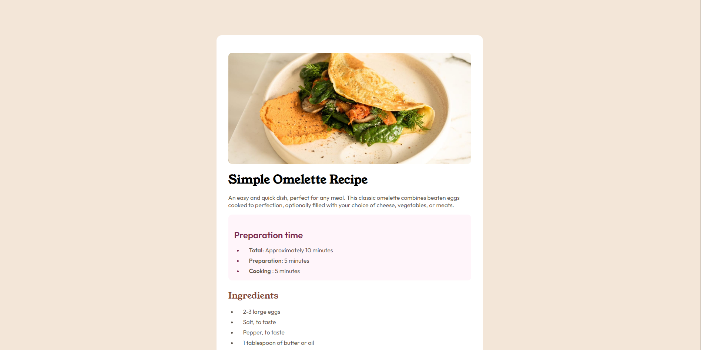
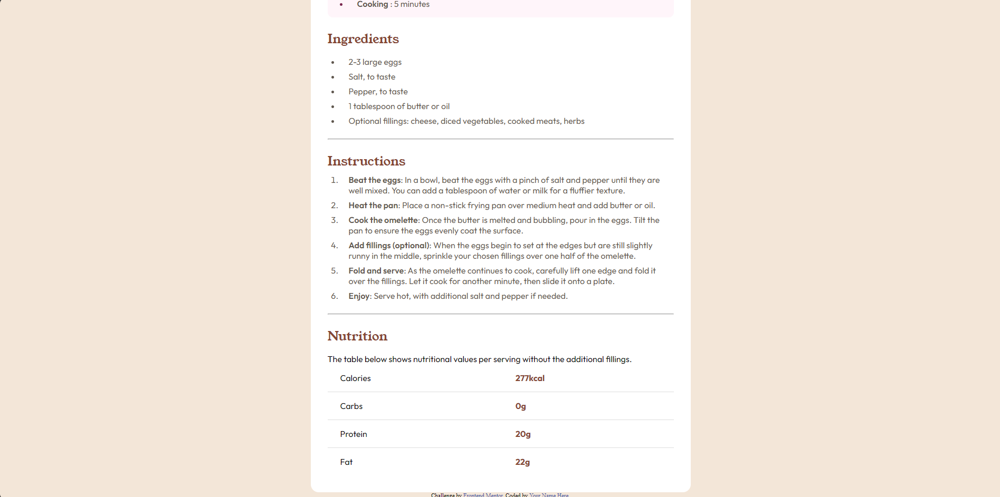

# Frontend Mentor - Recipe page solution

This is my solution to the Recipe page challenge on Frontend Mentor.

## Overview

This is a Recipe page component built with HTML and CSS

### Screenshots

### Links
- Solution URL: https://github.com/kenwoodly/recipe-page-main
- Live Site URL: https://kenwoodly.github.io/recipe-page-main/

## My process

### Built with
- Semantic HTML5
- CSS custom properties
- Flexbox

### What I learned
Working with dark backgrounds and hover 
states on interactive button elements.

## Author
- Frontend Mentor - https://www.frontendmentor.io/profile/kenwoodly